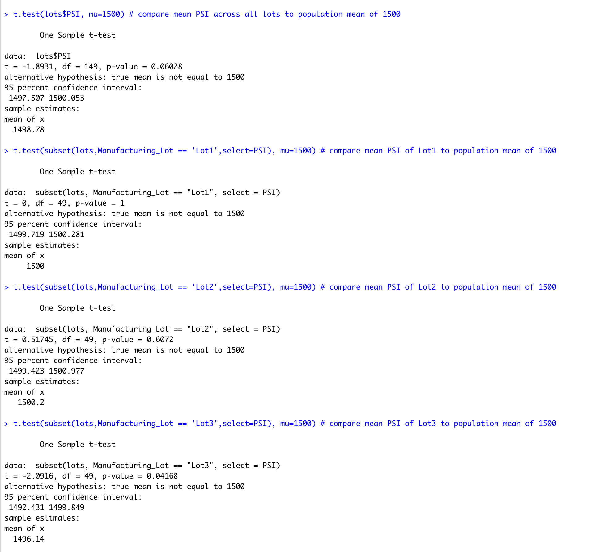

# MechaCar Statistical Analysis

## Linear Regression to Predict MPG

A statistical analysis of 50 prototype MechaCars which were produced using multiple design specifications is needed to determine if ideal vehicle performance, measured in MPG, can be predicted.  For each vehicle, data on vehicle length, vehicle weight, spoiler angle, ground clearance, and drivetrain (AWD) were collected in addition to the MPG performance.

To create this analysis, a multiple linear regression model was developed to determine if there is sufficient evidence that the input design specifications can predict the resulting performance in MPG and the following summary statistics were collected:

From these statistics we can infer the following:

1) Vehicle length and ground clearance (in addition to the intercept) have a significant impact on MPG performance, because their individual variable p-values are less than 0.05. 
2) The slope of the regression model is not 0 as indicated by the overall p-value being much less than our significance level of 0.05.
3) The linear model is at least somewhat effective at predicting MPG.  The overall p-value is less than 0.05 which means that we can accept the alternate hypothesis that these variables do have a statistically significant impact on MPG performance.  The Multiple R-squared value of 0.71 indicates that 71% of the variability in MPG performance is explained by this model. It may be possible to refine the model and achieve a higher R-squared value by looking for other potential design factors instead of those like spoiler angle and drivetrain, which did not individually have significant p-values.

## Summary Statistics on Suspension Coils

Summary statistics were developed for 3 productions lots to determine if the manufacturing process for suspension coils is consistent.  The design specifications dictate that the variance of suspension coils must not exceed 100 PSI.  Based on the data provided, we are able to review the summary statistics across all three lots as shown below:

Across all 3 lots, the production quality meets the design specifications - the total variance of 62.29356 is well below the threshold of 100.

However, when we analyze the lots individually as shown below, we see that Lot 3 is currently out of spec:

The variance of 170.2861224 is well over the threshold of 100.  This was masked in the total data set by the far more consistent production in Lots 1 and 2.

## T-Tests on Suspension Coils

Additional analysis was performed on the suspension coil production data to test whether the PSI for each manufacturing lot is statistically different from the population mean of 1500 PSI.  A one-sample t-test was conducted 4 times: first for the total population, then once each for each of the 3 manufacturing lots.  Results are shown below:

P-values were greater than our significance level of 0.05 for the first 3 tests, indicating that we do not have sufficient evidence to reject the null hypothesis and therefore the observed means are statistically similar to the population mean of 1500.
- total population p-value was 0.06
- Lot1 p-value was 1.00
- Lot2 p-value was 0.61

However, Lot3 has a p-value of 0.04, which is less than our significance level and we therefore reject the null hypothesis and state that the mean PSI of Lot3 is statistically different from the population mean of 1500.

## Study Design: MechaCar vs Competition

MechaCar would like to conduct a study to compare MechaCar vehicles to the performance of vehicles from other manufacturers.  Given fuel prices, I believe that consumers are highly interested in fuel efficiency.  If MechaCar can demonstrate that their vehicles are more fuel efficient than competitors cars, that would be appealing to potential consumers.  

To test fuel efficiency, I would look at average highway MPG for MechaCar's vs competitor's cars.  The null hypothesis would be that MechaCar's mean MPG is not statistically different from competitor's.  The alternative hypothesis would be that MechaCar's mean MPG is statistically different.  

I would use either a two-sample t-test or ANOVA to test the hypothesis.  If we just want to compare MechaCar to all competitors, or to individual competitors one at a time, then we can use a two-sample t-test, which is specifically intended to answer the question - Is there a statistical difference between the distribution means from two samples.  However, if we'd like to compare MechaCar to multiple individual competitors at once, then the ANOVA test could be used.  It is intended to answer the question - Is there a statistical difference between the distribution means from multiple samples.

To conduct these tests, we would need data on highway MPG performance for multiple cars from both MechaCar's and other competitor's product lines. Perhaps we would also look at the performance across multiple model years.  MechaCar would likely have plenty of data on its own products, but would need to determine how to gain access to competitor car data.  They could either use the fuel efficiencies that are published by the manufacturer when cars are sold or could perhaps rent and test competitor cars on the same tests that they use for their own cars.  Regardless, they would need sufficient data to ensure that the results can be relied upon.

