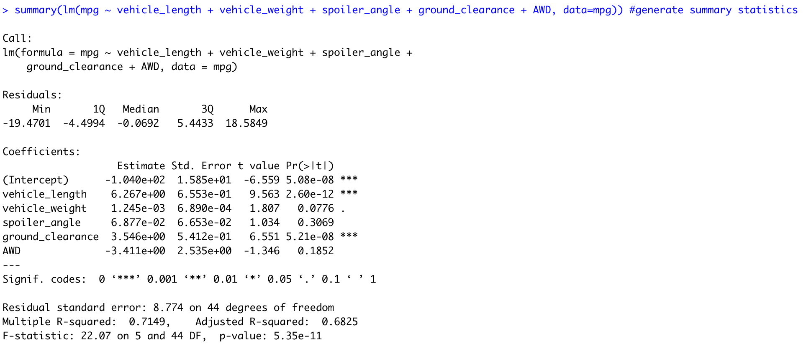

# MechaCar Statistical Analysis

## Linear Regression to Predict MPG

A statistical analysis of 50 prototype MechaCars which were produced using multiple design specifications is needed to determine if ideal vehicle performance, measured in MPG, can be predicted.  For each vehicle, data on vehicle length, vehicle weight, spoiler angle, ground clearance, and drivetrain (AWD) were collected in addition to the MPG performance.

To create this analysis, a multiple linear regression model was developed to determine if there is sufficient evidence that the input design specifications can predict the resulting performance in MPG and the following summary statistics were collected:

From these statistics we can infer the following:

1) Vehicle length and ground clearance (in addition to the intercept) have a significant impact on MPG performance, because their individual variable p-values are less than 0.05. 
2) The slope of the regression model is not 0 as indicated by the overall p-value being much less than our significance level of 0.05.
3) The linear model is at least somewhat effective at predicting MPG.  The overall p-value is less than 0.05 which means that we can accept the alternate hypothesis that these variables do have a statistically significant impact on MPG performance.  The Multiple R-squared value of 0.71 indicates that 71% of the variability in MPG performance is explained by this model. It may be possible to refine the model and achieve a higher R-squared value by looking for other potential design factors instead of those like spoiler angle and drivetrain, which did not individually have significant p-values.
